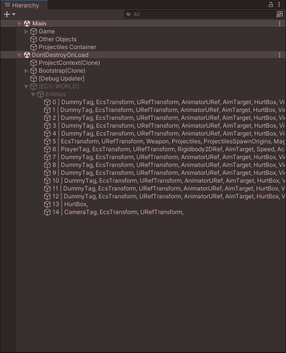
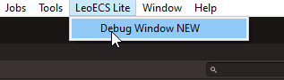
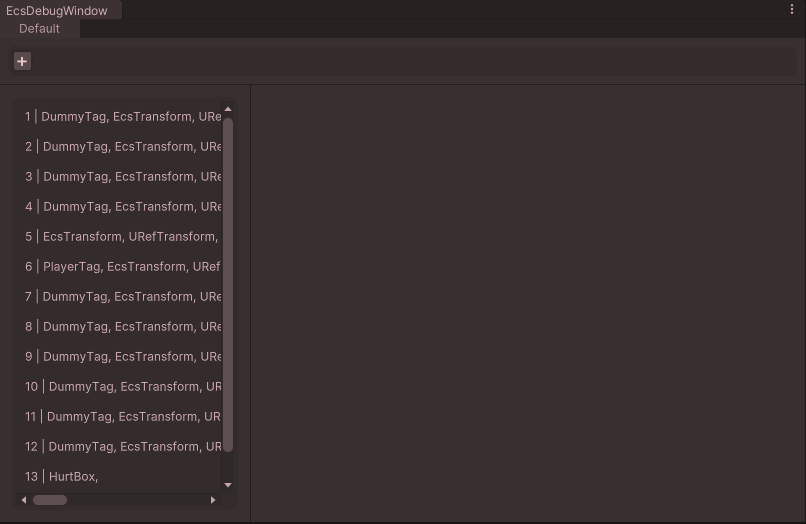
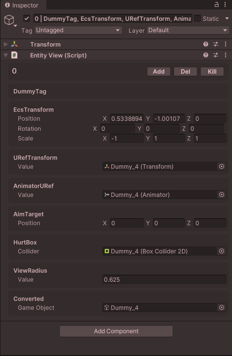
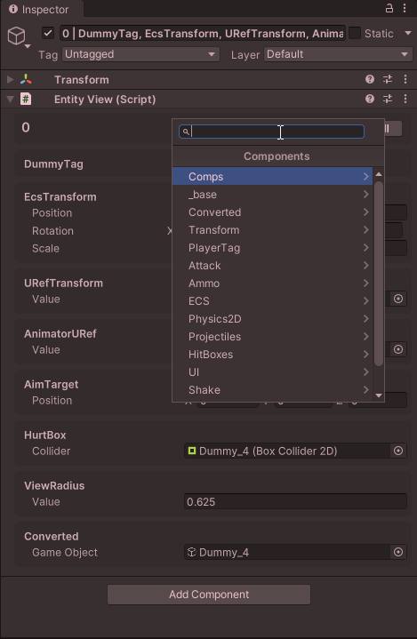
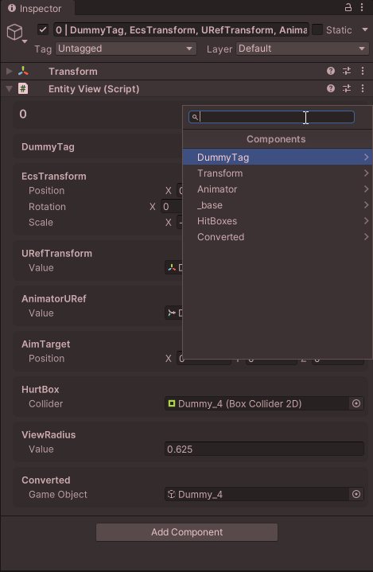
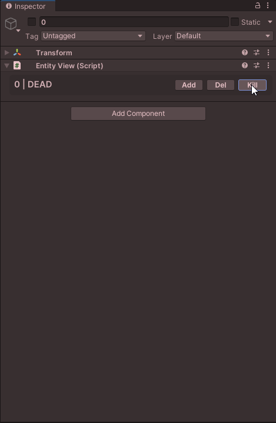
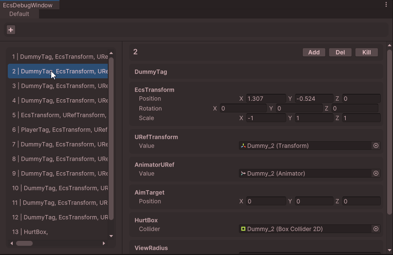
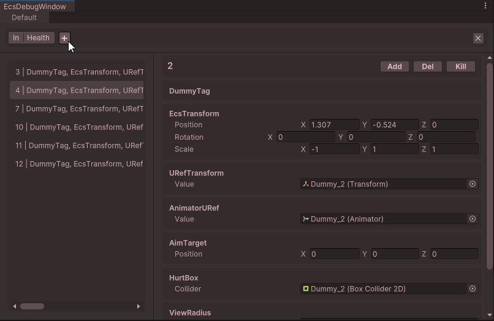

# Интеграция в редактор Unity для LeoECS Lite
Интеграция в редактор Unity с мониторингом состояния мира \
( не подразумевает [конвертацию / создание через инспектор](https://github.com/Mitfart/LeoECSLite.UniLeo) )

> Проверено на Unity ***2021.3 LTS*** (зависит от Unity) 


# Содержание
* [Установка](#Установка)
  * [В виде Unity модуля](#В-виде-Unity-модуля)
  * [В виде исходников](#В-виде-исходников)
* [Интеграция](#Интеграция)
  * [Подключение системы](#Подключение-системы)
  * [Объявление компенента](#Объявление-компенента)
  * [Просмотр](#Просмотр)
* [Возможности](#Возможности)
* [Обратная связь](#Обратная-связь)
* [Good practices](#Good-practices)
* [Вопросы-ответы](#Вопросы-ответы)


# Установка

> **ВАЖНО!** Зависит от [LeoECS Lite](https://github.com/Leopotam/ecslite)
- `фреймворк должен быть установлен до этого расширения`

### В виде Unity модуля
##### Через Package manager:
- Откройте Package manager
- Нажмите плюс в левом верхнем углу
- "Add from git url" и вставьте:

```
https://github.com/Mitfart/LeoECSLite.UnityIntegration.git
```

##### или через добавление в *@/Packages/manifest.json*:
```
"com.mitfart.leoecslite.unity-integration": "https://github.com/Mitfart/LeoECSLite.UnityIntegration.git",
```

### В виде исходников
Код также может быть склонирован или получен в виде архива


# Интеграция

### Подключение системы
```c#
// ecs-startup code:
IEcsSystems _systems;

void Start() {        
    _systems = new EcsSystems (new EcsWorld());
    _systems
        .Add (new TestSystem1())
#if UNITY_EDITOR
        // Регистрируем отладочные системы по контролю за состоянием каждого отдельного мира:
        // .Add (new LeoECSLite.UnityIntegration.EcsWorldDebugSystem("events"))
        .Add(new LeoECSLite.UnityIntegration.EcsWorldDebugSystem())
        // Для коректного отображения данных, системы необходимо подключать в конце
#endif
        .Init();
}

void Update() {
    // Отладочные системы являюся обычными ECS-системами и для их корректной работы
    // требуется выполнять их запуск через EcsSystems.Run()
    _systems?.Run();
}
```
> **ВАЖНО!** По умолчанию названия компонентов **НЕ** записываются в имя
> (как в системе от `Leopotam`)
> Если такое поведение нужно, то его
> можно добавить создав пресет настроек для системы
> ```cs
> var nameSettings = new EntityNameSettings(bakeComponents: true);
> ...
> .Add(new LeoECSLite.UnityIntegration.EcsWorldDebugSystem(null, nameSettings))
> ...
> ```

### Объявление компонента

```c#
[Serializable] // <-- Для отображения данных компонент долже быть сериализован
public struct Comp {
    public string value;
}
```


# Просмотр
Для просмотра можно использовать два способа:
- Классический / Просмотр напрямую \


- Используя специальное окно:
> Открыть которое можно **в верхнем меню** \
> **LeoEcs Lite -> Debug Window**




### Entity


##### Кнопка "Add" - ``добавить компонет``


##### Кнопка "Del" - ``удалить компонет`` 


##### Кнопка "Kill" - ``удалить / убить энтити``


##### В спец. окне


### Фильтрация



# Возможности
+ Полностью автоматическое отображение компонентов в инспекторе
+ Добавление/удаление компонентов через инспектор `(в рантайме)`
+ Удаление `Entity`
+ Расширение логики `View-компонентов` используя [кастомный Editor](https://discord.gg/5GZVde6)
+ [Фильтрация сущностей](#Фильтрация) `(в спец окне / по-имени объекта)`

### Планируется
+ Можете [предложить](#Обратная-связь)


# Обратная связь
#### Discord [Группа по LeoEcsLite](https://discord.gg/5GZVde6)
#### Telegram [Группа по Ecs](https://t.me/ecschat)
```
@Mitfart
```


# Good practices
+ Использование [специального окна](#В редакторе)
+ Отключение запекания компонентов в имя энтити `(если не необходимо)`
+ Сворачивание списка `Entity` в иерархии
+ Использлвание **ЛИБО** специального окна **ЛИБО** иерархии \
  `(При использование обоих тратится вдвое больше ресурсов)`


# Вопросы-ответы

### При переименовании / изменении неймспейса типа, компонент "ломается"
**Решение:** Добавьте атрибут [MovedFrom](https://github.com/Unity-Technologies/UnityCsReference/blob/master/Runtime/Export/Scripting/APIUpdating/UpdatedFromAttribute.cs) \
`после "починки", атрибут можно убрать`
```cs
[MovedFrom(
   autoUpdateAPI: false, 
   sourceNamespace: "OldNamespace", // null, if you don't change it
   sourceAssembly: "OldAssembly",   // null, if you don't change it
   sourceClassName: "OldName"       // null, if you don't change it
)]
public struct Comp { ... }
```

### Я хочу создавать сущности в `IEcsPreInitSystem`, ноотладочные системы бросают исключения в этом случае. Как это исправить??

**Причина:**`EcsWorldDebugSystem` тоже является `IEcsPreInitSystem` и происходит конфликт из-за порядка систем. \
**Решение 1:** - вместо `IEcsPreInitSystem` использовать `IEcsInitSystem` \
**Решение 2:** - все отладочные системы следует вынести в отдельный `IEcsSystems` и 
вызвать его инициализацию раньше основного кода:
```c#
IEcsSystems _systems;
#if UNITY_EDITOR
IEcsSystems _editorSystems;
#endif


void Awake() {
    _systems = new EcsSystems (new EcsWorld());
    
#if UNITY_EDITOR
    // Создаем отдельную группу для отладочных систем.
    _editorSystems = new EcsSystems (_systems.GetWorld());
    _editorSystems
      .Add(new LeoECSLite.UnityIntegration.EcsWorldDebugSystem(null, nameSettings))
      .Init ();
#endif

  _systems
    .Add (new Sys())
    .Init();
  }
}


void Update() {
    _systems?.Run();
    
#if UNITY_EDITOR
    // Выполняем обновление состояния отладочных систем. 
    _editorSystems?.Run ();
#endif
}
    
    
void OnDestroy () {
#if UNITY_EDITOR
  // Выполняем очистку отладочных систем.
  if (_editorSystems != null) {
      _editorSystems.Destroy ();
      _editorSystems = null;
  }
#endif
  if (_systems != null) {
      _systems.Destroy();
      _systems.GetWorld().Destroy();
      _systems = null;
  }
}
```

### Я хочу добавить свою логику для компонента в окне инспектора. Как я могу это сделать?

Написав свой `Editor / PropertyDrawer` для компонента:

В стандартном эдиторе: ```@/Editor/Component/ComponentEditor.cs``` \
используется [UIToolkit](https://docs.unity3d.com/Manual/UIE-HowTo-CreateCustomInspector) \
`использование стандартного GUILayout, возможно, но не рекомендуется`

```c#
#if UNITY_EDITOR
using UnityEditor;
using UnityEditor.UIElements;
using UnityEngine.UIElements;
using Mitfart.LeoECSLite.UnityIntegration;

[CustomEditor(typeof(ComponentData<Comp>))] 
public class ComponentDataEditor : Editor {
  public override VisualElement CreateInspectorGUI() {
    // Создание главного/родительского элемента
    var container = new VisualElement();
    // ...
    return container;
  }
}
#endif
```